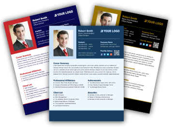

  I did think that resumes were one of the only ways that you could use to tell an employer what sort of experience you have in comparison to what another person might present. Professional portfolios actually seem like a resume but online and open for potential employers to look at and gain an understanding of your personality, at least your online persona. Knowing the online personality of a person does not mean that they may be exempt from an interview or possible scrutiny of contributions to a project or the works done. This did not shake up my entire view of employment but it does create a wider scope of what can be done to make employment easier.
  
  
  
  I already knew that employers might look at things like social media accounts to get a better understanding of that person but professional portfolios that can make an easy call back never crossed my mind. When I really think about it, you could get credit for the projects done but it is easier to link to all of them and make it easier on any employer to look at the project and figure what sort of contributions you made. Having source code for personal projects or open source projects might give an edge to how competent that person may be or how much passion they might have for the field that they are working for. It shows how the internet has advanced even further than what people may think, going past doing things using a site to make your own website.

  The main things done with these professional profiles is that they would be like a more eye pleasing version of a resume. It would be like going through a person's facebook, specific information for the employer can be seen and it may contain more information than the resume given to the employer. This could show, not only what university you studied at but it can also show previous workplaces, experience, and projects. These portfolios may even be used in a social manner like in this website, showing things like previous comments and questions.

