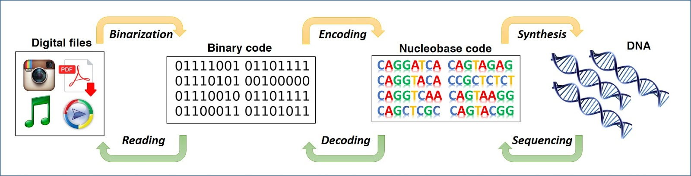

This is an individual research presentation for my botany class. Because my peers and teachers in the class may not know about how our computers would store the data, I had to go over that as a starting point. It would then relate this given knowledge and connect it to DNA before going over how this would relate to botany. The relationship with botany has a brief mention of a code implanted and was perfectly replicated from parent to child and the possibilities that this could possess. It also goes over other reasons that plants could be used in this field and ideas that may or may not come to fruition in the futrure.

Because this was an individual research project, I had to do all of the research, preperation, and presentation. I have no contributions with the articles or anything involved in the subject, other than looking it up and using the information in my presentation. The first thing I had to do was put my presentation together and make it at least presentable, having pictures and little to know grammatical errors. I then had to think about what I would say within a ten minute time and cut out anything, if I did not have any time to go more in-depth with the subject. 

The first thing I learned is that ideas anybody could have may not be as absurd because I initially thought that DNA and computer memory could have similarities but it may be in the realm of science fiction. Looking deeper into it, I found out that this was something that has been researched and developed as DNA technology has been advancing and getting cheaper. The other thing I learned was how absurd things can be more absurd than you initially thought because I came across a link about people making processors using DNA. This was something that I did not think was being done until I happened to find it during my research. 

The presentation is here: <a href="https://github.com/Edward-Yi/Edward-Yi.github.io/blob/master/projects/DNA%20and%20Computer%20Storage.pptx"></i>Powerpoint download</a>
