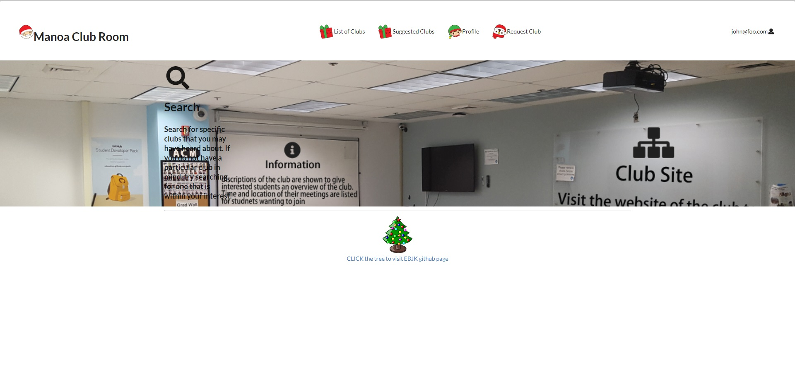

When you first enter the site, you end up at the landing page and you need to sign in or sign up to gain access to other parts of the site, depending on role. For a regular user, they can browse clubs, edit their profile page, and make a request to add a club to the list. The club admin can edit the club(s) that they are recognized as the owner, otherwise, club admins have the same access as a regular user. Admins have the ability to delete clubs and approve or deny a request that a user makes for including a new club.

I contributed to this project by creating the mockup for the landing page and the browse club, in the first milestone. I worked on the search filter, search and interest filter, in the second milestone and sorting the clubs into alphabetical order, at least the default clubs. For the third and final milestone, I worked on getting the register club and admin approval/denial to work, along with the approval moving the data to club database and deleting it from the request database, both in approval and denial.

More information: https://manoaclubroom.github.io/
