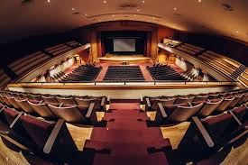

During my four years attending President William McKinley High School, I was in their orchestra class. Orchestras are typically divided into five sections, cello, bass, violin, second violin, and viola, and I played in the second violin section.. The main requirements for this class was practice and playing in the concerts that are held in the high school's auditorium or other venues. During class, we would practice together in a room in a building or on stage, in the auditorium, to prepare for all the upcoming concerts.

My contributions is practicing the music in the orchestra and making sure that I am playing at an acceptable level, at least being able to keep up with those in my section, second violin. I also attended the rehearsals and sectionals, practicing with those in my section, to get a better idea of the changes and techniques that were made before the concert. I also helped to do cleanup when the concert is done, the decorations around the auditorium is picked up, sweeped, or vaccumed, they are thrown away if they were not vaccuumed. 

The main things I got out of playing with the orchestra is how to persevere, how much of a difference practice makes, and how to work with and around a group. The focus of how to work with and around a group, in this setting, is how to practice individually and thinking about how I can contribute to the group. Sometimes, I did not want to practice or attend the sectionals/rehearsals, however, I dragged my body to these and went through with it when I could be at home. Before thinking about how practice can keep a person's skill sharp, I thought that practice was to reach greater heights and the skills that you received from practicing would stick but this experience changed my entire mind about this idea.

One of the concerts I was in: [Video](https://www.youtube.com/watch?v=mhQh7CB0VsY)
